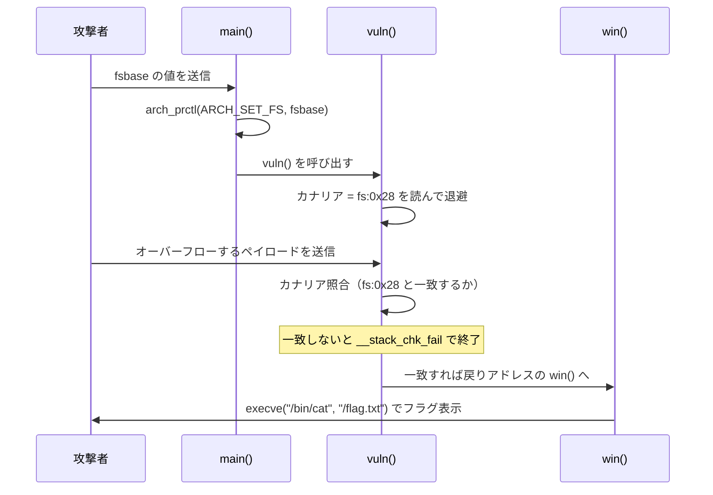
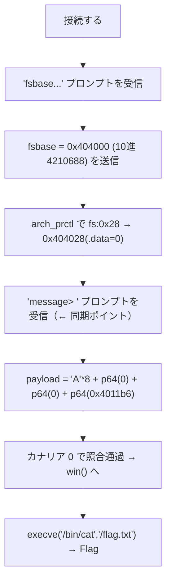

> [!IMPORTANT]
> **Solved with Gemini in Colab**
>
> この問題は Google の AI コーディングアシスタント **Gemini in Colab** を活用して解決されました。

> [!NOTE]
> この Writeup は AI により自動生成されています。 本ドキュメントは、AI アシスタントを用いて作成された Writeup です。記載内容は解法の一例であり、内容の正確性については十分にご確認の上ご利用ください。

# fsbase modification

## 概要
*   **カテゴリー**: Pwn
*   **トピック**: x86
*   **難易度**: Hard 8.0
*   **問題リンク**: [fsbase modification - Daily AlpacaHack](https://alpacahack.com/daily/challenges/fsbase-modification)

## 使用ツール
*   **Python 3**: 解法スクリプト（エクスプロイト）の実装
*   **socket**: リモートサーバーとの TCP 通信（Python 標準ライブラリ）
*   **struct**: アドレスを 64bit リトルエンディアンのバイト列に変換（Python 標準ライブラリ）
*   **objdump / readelf**: バイナリの逆アセンブルとヘッダ解析（`win` のアドレスやセクション配置の確認）
*   **Gemini in Colab**: 配布ファイルの解析およびコード生成

## 問題の分析
本問題は、**Daily AlpacaHack** の Pwn（x86）問題です。配布ファイルは次の通りです。

| ファイル | 内容 |
| :--- | :--- |
| `chal` | 攻撃対象の 64bit ELF 実行ファイル |
| `chal.c` | `chal` のソースコード |
| `Dockerfile` / `compose.yaml` | リモート環境（Ubuntu 24.04 + xinetd）の構成 |
| `flag.txt` | フラグ（配布版はダミー。本物はサーバー上の `/flag.txt`） |

ソースコード `chal.c` の要点は次の 3 つの関数です。

```c
// gcc -o chal chal.c -no-pie
void __attribute__((__used__)) win(void) {
    char *argv[] = {"/bin/cat", "/flag.txt", NULL};
    syscall(SYS_execve, argv[0], argv, NULL);          // /flag.txt を表示する
}

void vuln(void) {
    char buf[8] = {0};
    write(STDOUT_FILENO, "Please leave a message> ", 24);
    read(STDIN_FILENO, buf, 32);                        // ★ 8 バイトの buf に 32 バイト読む
}

int main(void) {
    write(STDOUT_FILENO, "fsbase(-1 for testing a default vuln behavior): ", 48);
    char buf[32] = {0};
    read(STDIN_FILENO, buf, sizeof(buf) - 1);
    unsigned long fsbase = strtoul(buf, NULL, 10);

    int result = syscall(SYS_arch_prctl, ARCH_SET_FS, fsbase);  // ★ fsbase を任意に変更
    if (result < 0) {
        write(STDOUT_FILENO, "arch_prctl failed.\n", 19);
    }
    vuln();
}
```

やりたいことは単純で、戻りアドレスを `win()` に書き換えて `/flag.txt` を読ませることです。`vuln()` の `read(buf, 32)` は 8 バイトの `buf` に 32 バイト書き込めるので、スタックバッファオーバーフローが成立します。

ところが、このバイナリには **スタックカナリア** があります。戻りアドレスを書き換えるには途中のカナリアも通過しなければならず、値を間違えると `*** stack smashing detected ***` で強制終了します。



このバイナリの保護機構を `readelf` で確認すると次の通りです。

| 保護 | 状態 | 影響 |
| :--- | :--- | :--- |
| Canary | ✅ 有効（`__stack_chk_fail`） | 戻りアドレス改ざん前にカナリアの通過が必要 |
| NX | ✅ 有効（`GNU_STACK` が `RW`） | スタック上のシェルコードは実行不可 |
| PIE | ❌ なし（`-no-pie`、`ET_EXEC`） | `win` のアドレスが `0x4011b6` に固定され、そのまま使える |
| RELRO | Partial（遅延バインド有効） | 本問では直接は使わない |

PIE が無効なので `win()` のアドレスは $`\mathtt{0x4011b6}`$ に固定（`objdump` で確認）です。

```
$ objdump -d chal | grep "<win>"
00000000004011b6 <win>:
```

したがって、残る関門は **カナリアをどう突破するか** だけです。そして、この問題の鍵がタイトルの **fsbase** です。

## 脆弱性の詳細

### スタックカナリアと fs:0x28
x86-64 の GCC が生成するスタックカナリアは、**`fs` セグメント相対のアドレス `fs:0x28`**（線形アドレスで $`\text{fsbase} + \mathtt{0x28}`$）から読み出されます。`fs` のベースアドレス（fsbase）が指す先には TLS/TCB（スレッド制御ブロック）があり、そのオフセット `0x28` に乱数のカナリア値（`__stack_chk_guard`）が格納されているためです。

`vuln()` の逆アセンブルを見ると、関数の入口でカナリアを退避し、出口で照合しています。

```asm
vuln:
    push   rbp
    mov    rbp, rsp
    sub    rsp, 0x10
    mov    rax, QWORD PTR fs:0x28     ; ← カナリアを読む（fsbase + 0x28）
    mov    QWORD PTR [rbp-0x8], rax   ;   スタックに退避
    ...
    lea    rax, [rbp-0x10]            ; buf のアドレス
    mov    edx, 0x20                  ; 0x20 = 32 バイト
    call   read                       ; read(0, buf, 32)  ← オーバーフロー
    ...
    mov    rax, QWORD PTR [rbp-0x8]   ; 退避したカナリア
    sub    rax, QWORD PTR fs:0x28     ; ← もう一度 fs:0x28 と照合
    je     ok
    call   __stack_chk_fail           ; 不一致なら強制終了
ok: leave
    ret
```

通常、`fs:0x28` の値はプロセスごとにランダムで、リークもないため予測できません。これが「カナリアがあると素朴なオーバーフローは通らない」理由です。

### fsbase を書き換えてカナリアを「既知」にする
ここで `main()` が呼んでくれる `arch_prctl(ARCH_SET_FS, fsbase)` が効いてきます。これは **fsbase（fs のベースアドレス）を任意の値に設定する** システムコールです。

| 項目 | 値 |
| :--- | :--- |
| `SYS_arch_prctl` | `158`（`0x9e`） |
| `ARCH_SET_FS` | `0x1002` |
| 効果 | `fs` のベースアドレスを第 2 引数の値に設定する |

カナリアは `fs:0x28`、すなわち線形アドレス `fsbase + 0x28` から読まれます。つまり **fsbase を「中身を自分が知っているメモリ」に向ければ、カナリアの値を知ることができます**。

このバイナリは no-PIE なので、書き込み可能なデータ領域のアドレスも固定です。`readelf` で `.data` の先頭（`__data_start`）を確認すると $`\mathtt{0x404028}`$ にあり、その中身は **0**（ゼロ初期化）です。

```math
\text{fsbase} = \mathtt{0x404000} \;\Longrightarrow\; \text{canary} = *(\text{fsbase} + \mathtt{0x28}) = *(\mathtt{0x404028}) = \mathtt{0}
```

`0x404000` は書き込み可能な LOAD セグメント（`0x403df8`〜`0x404040`、RELRO 領域より後ろ）の内側にあるので、arch_prctl は成功し（canonical アドレス）、かつ `fs:0x28 = 0x404028` は `.data` のゼロ領域を指します。退避時も照合時も同じ `0x404028`（= 0）を読むので、**カナリアを 0 だと確定できる**のです。

> [!TIP]
> 10 進で送る点に注意です。`main()` は `strtoul(buf, NULL, 10)` で **10 進**として解釈するので、`0x404000` は `4210688` と送ります。

### スタックの配置とペイロード
`vuln()` のフレームは `sub rsp, 0x10` と逆アセンブルから次のようになっています（`buf` は `rbp-0x10`、カナリアは `rbp-0x8`）。

```
   アドレス高位 ↑
 +-----------------------------+  rbp+0x08  ← 戻りアドレス（ここを win に）
 |      return address (8)      |
 +-----------------------------+  rbp+0x00  ← 保存された rbp
 |       saved rbp (8)          |
 +-----------------------------+  rbp-0x08  ← カナリア（fs:0x28 = 0）
 |       canary (8)             |
 +-----------------------------+  rbp-0x10  ← buf の先頭（read はここから）
 |       buf[8]                 |
 +-----------------------------+
   アドレス低位 ↓
```

`buf` の先頭から戻りアドレスまでの距離は次の通りです。

```math
\underbrace{\mathtt{0x10}}_{buf \to rbp} + \underbrace{\mathtt{0x08}}_{saved\ rbp} = \mathtt{0x18} = 24\ \text{バイト}
```

よって 32 バイトのペイロードは次の構成になります（`read` が最大 32 バイト読むのにちょうど収まります）。

| オフセット | サイズ | 内容 | 値 |
| :--- | :--- | :--- | :--- |
| `+0x00` | 8 | `buf[8]` を埋める | `b"A" * 8` |
| `+0x08` | 8 | カナリア | `p64(0)` |
| `+0x10` | 8 | 保存された rbp | `p64(0)`（ダミー） |
| `+0x18` | 8 | 戻りアドレス | `p64(0x4011b6)`（= `win`） |

> [!WARNING]
> **送信は必ず 2 回に分ける**必要があります。`main()` の `read(buf, 31)` は「最大 31 バイト」を読むため、`fsbase` 行とペイロードを一度に送ると、`main` の `read` がペイロードの先頭まで食べてしまい、`vuln` の `read` に届く量が足りず攻撃が失敗します（カナリアが上書きされず、最終的に `main` 側のカナリアチェックで `stack smashing` になります）。
>
> そこで `Please leave a message> ` のプロンプトを受信してからペイロードを送る、という同期を行います（solve.py の `recv_until` がこれを担当）。実際に手元で試すと、同期しない場合は失敗、同期すると `win` に到達することを確認しました。

### 攻撃フロー


<details>
<summary>📌 補足: fsbase を -1 にすると何が起きるか（クリックで展開）</summary>

プロンプトの「`-1 for testing a default vuln behavior`」が示す通り、`-1` を送ると `strtoul("-1", ...,10)` は `ULONG_MAX`（非 canonical アドレス）になり、`arch_prctl` は失敗して `arch_prctl failed.` が表示されます。この場合 fsbase は元のまま（本物のランダムカナリア）なので、カナリアを知る術がなく、素朴なオーバーフローは `stack smashing` で弾かれます。これが「デフォルト（脆弱だが解けない）挙動」です。fsbase を書き換えて初めてカナリアが既知になる、というのが本問の核心です。

</details>

## 用語解説
*   **fsbase（FS ベースアドレス）**: x86-64 の `fs` セグメントレジスタが指す先頭アドレス。`fs:0xNN` という参照は「fsbase + 0xNN」の線形アドレスへのアクセスを意味します。通常はスレッドごとの TLS/TCB を指します。
*   **arch_prctl(ARCH_SET_FS, addr)**: fsbase を `addr` に設定する Linux のシステムコール（番号 `158`、`ARCH_SET_FS = 0x1002`）。本問ではこれで fsbase を自由に変更できるのが脆弱性の入口です。
*   **スタックカナリア（Stack Canary）**: 関数の戻りアドレス手前に置く番兵の値。関数の入口で `fs:0x28` から読んで退避し、出口で照合します。不一致なら `__stack_chk_fail` でプログラムを落とし、戻りアドレスの改ざんを検知します。
*   **`fs:0x28` / `__stack_chk_guard`**: カナリアの格納場所。TCB の先頭から `0x28` の位置にあり、通常はプロセス起動時にランダムな値が入ります。
*   **TLS / TCB**: Thread Local Storage / Thread Control Block。スレッド固有データの置き場所で、`fs` がその先頭を指します。
*   **スタックバッファオーバーフロー**: 確保したバッファより多くのデータを書き込み、隣接するカナリア・保存レジスタ・戻りアドレスなどを上書きしてしまう脆弱性。
*   **no-PIE / ET_EXEC**: 位置独立でない実行ファイル。コードやデータが固定アドレスに配置されるため、`win` のアドレス（`0x4011b6`）や `.data`（`0x404028`）をそのまま使えます。
*   **NX（No-eXecute）**: スタックなどのデータ領域を実行不可にする保護。本問ではシェルコードを置く代わりに、既存の `win` 関数へ飛ばします。
*   **RELRO**: GOT などを読み取り専用にする保護。本問は Partial RELRO ですが、今回の解法では直接は利用しません。
*   **リトルエンディアン / `p64`**: x86-64 ではアドレスを下位バイトから並べます。`struct.pack("<Q", 0x4011b6)` が 8 バイトのリトルエンディアン表現（`p64` 相当）を作ります。
*   **`win` 関数**: `execve("/bin/cat", ["/bin/cat", "/flag.txt"], NULL)` を呼ぶだけの関数。戻りアドレスをここに向ければフラグが表示されます。

## 解決スクリプト
[solve.py を参照してください](./solve.py)

```bash
# 追加ライブラリは不要（socket, struct は標準ライブラリ）
python3 solve.py                 # 既定の接続先（リモート）へ攻撃
python3 solve.py <host> <port>   # 接続先を指定（ローカル検証など）
```

配布ファイル（`fsbase-modification.tar.gz`）は問題ページから各自ダウンロードしてください（ローカル検証をする場合のみ）。ローカルで試す場合は、たとえば `socat TCP-LISTEN:<port>,reuseaddr,fork EXEC:./chal,stderr` でバイナリを TCP 公開し、そこへ solve.py を向けると動作を確認できます（`/flag.txt` が無い環境では `win()` が `cat: /flag.txt: No such file or directory` を返すので、`win` に到達したことが分かります）。
